# Sample application

This is a sample application to visualize dependency between objects. 

Creates Web Ui on 8050 port once ran. 

## Requirements

Python >3.7 is a requirement. 

## Installation

```
pip3 install networkx dash plotly
```

## How to run

```
python3 GraphAnalysis.py obj_dependency_data.csv
```

## How to access

Access Web UI on 8050 port. 


Task 4 screenshot :


Task 5 screenshot:


Bind data vs existing:


Task 6 screenshot:


volume:


Writer:

mounted volume:

Reader:

mounted volume :

Containers:

inspect:


Task 7 
screenshot:


Task 8 
screenshot:

https://hub.docker.com/repositories/pskorodz

Multistage is 436 MB comparing to initial 558 MB:
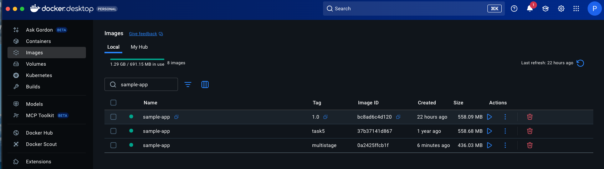
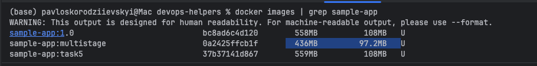

After: Layers reduced to 20, Vulnerabilities reduced to 23:
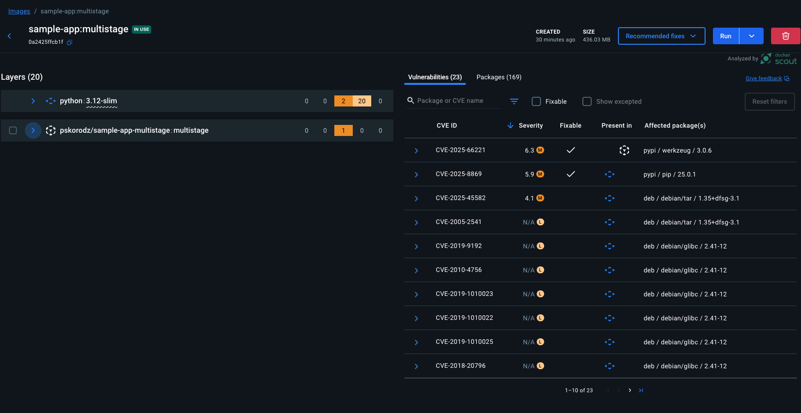

Before:
22 layers, 95 vulnerabilities
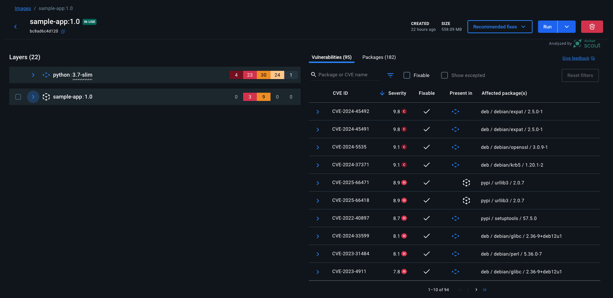


app working:
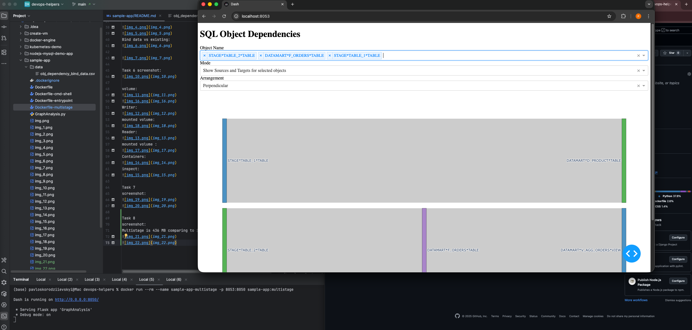

Dockerhub pushed
https://hub.docker.com/repository/docker/pskorodz/sample-app-multistage/general
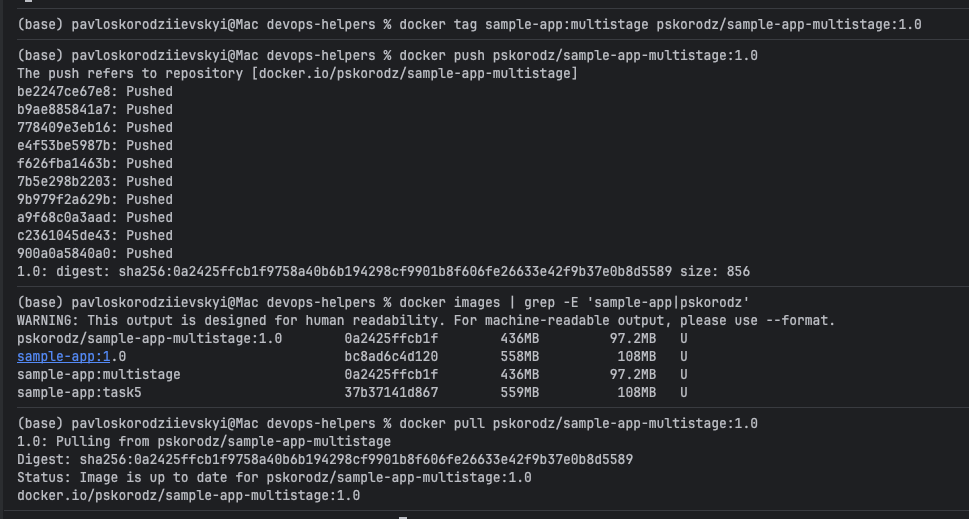
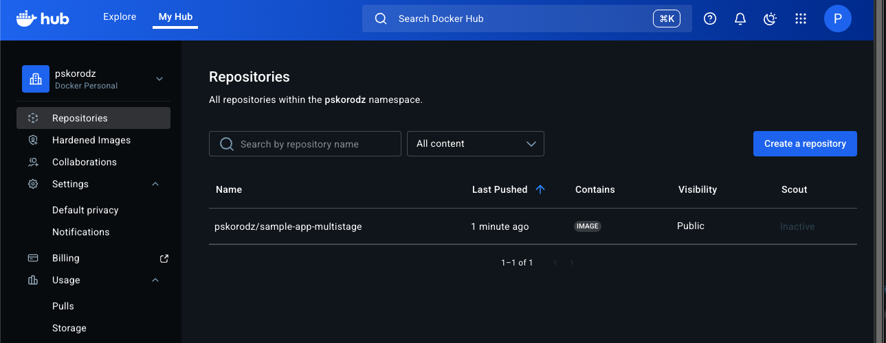

Alpine version reduced to 312MB:
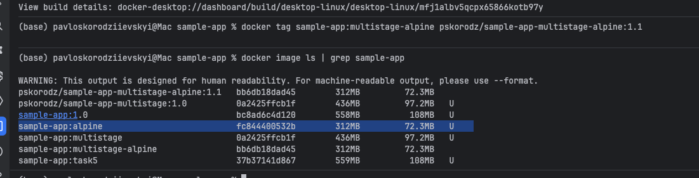
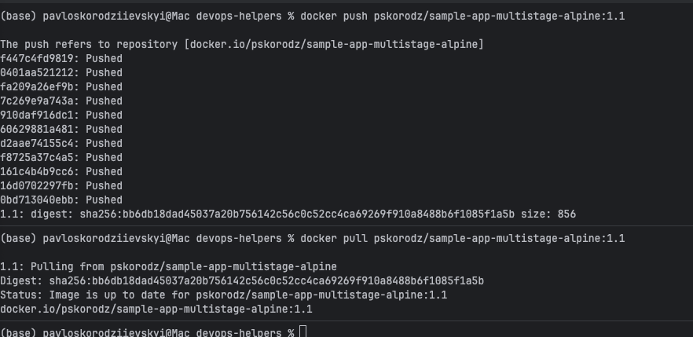

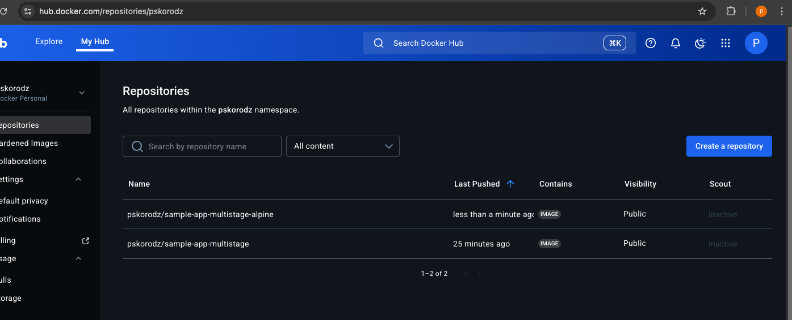

Issues reduced to 2:
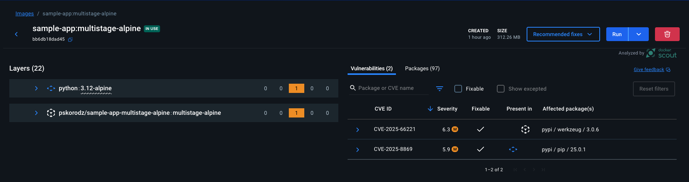