# Sample application

This is a sample application to visualize dependency between objects. 

Creates Web Ui on 8050 port once ran. 

## Requirements

Python >3.7 is a requirement. 

## Installation

```
pip3 install networkx dash plotly
```

## How to run

```
python3 GraphAnalysis.py obj_dependency_data.csv
```

## How to access

Access Web UI on 8050 port. 


Task 4 screenshot :
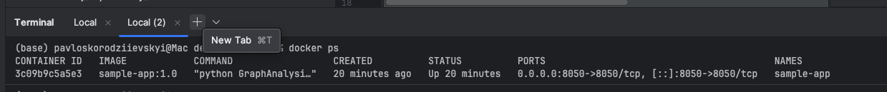
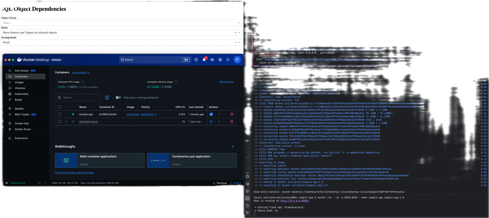
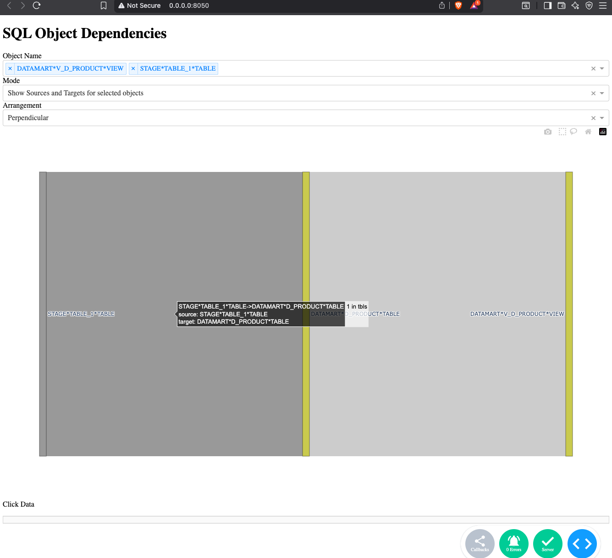
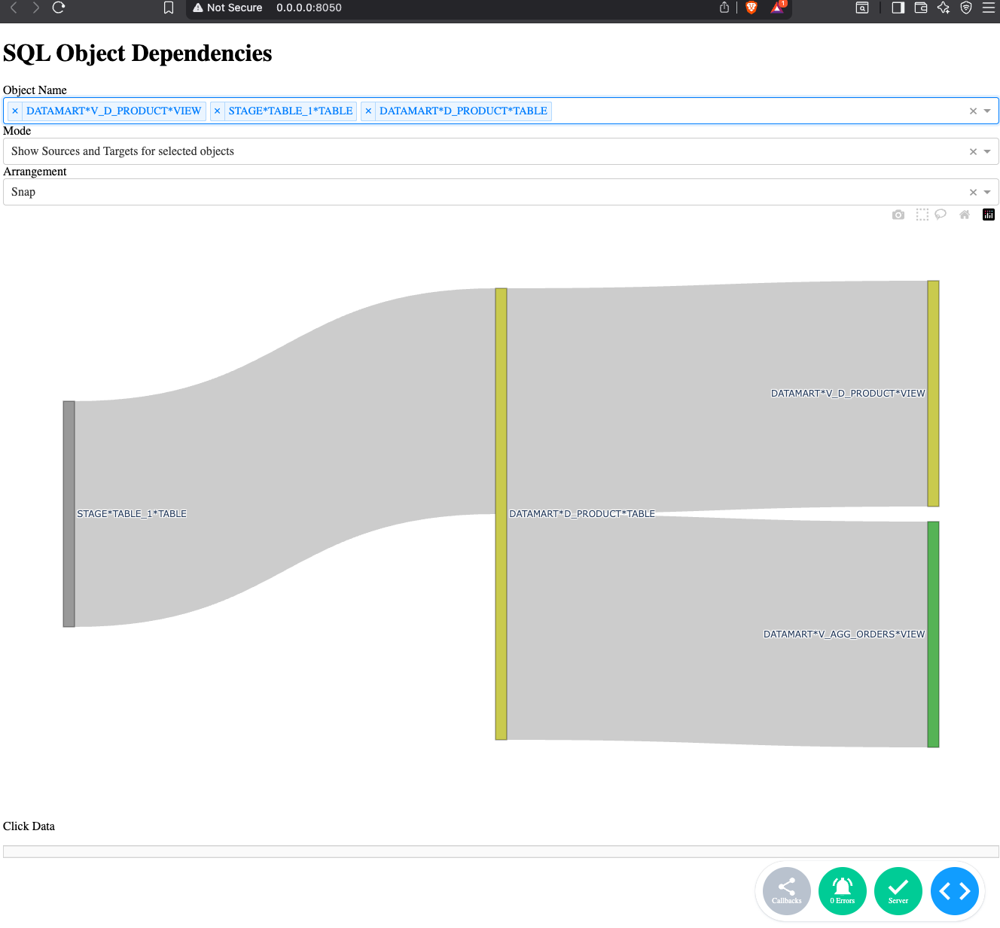

Task 5 screenshot:
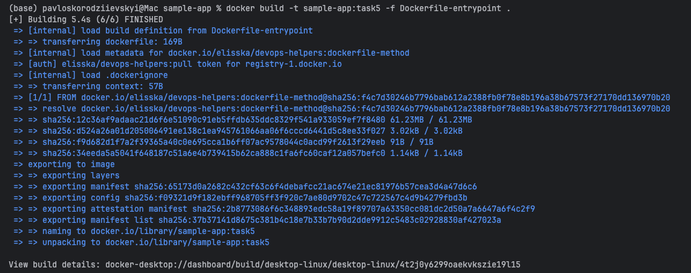
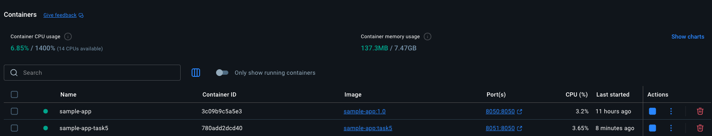

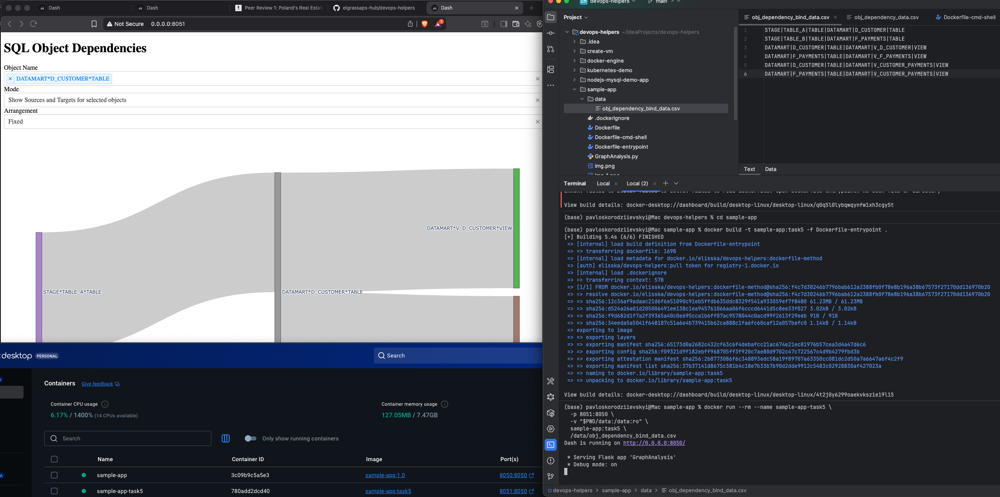
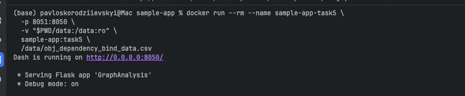
Bind data vs existing:
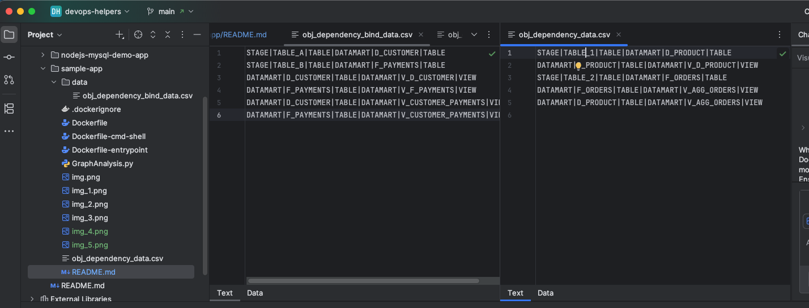

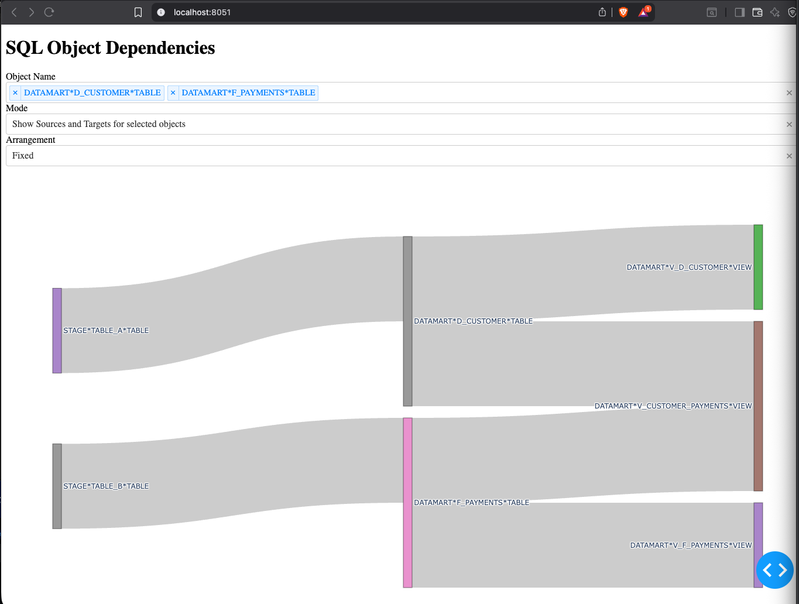

Task 6 screenshot:
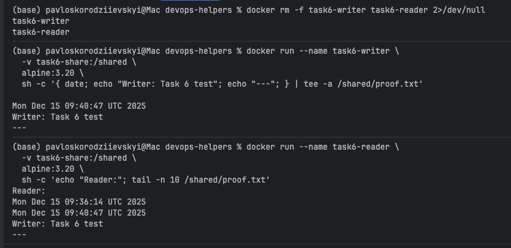

volume:
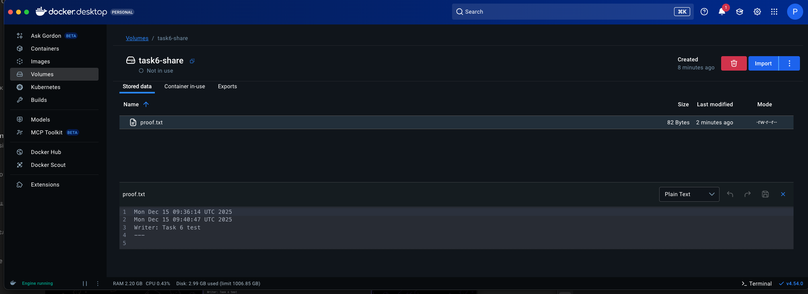
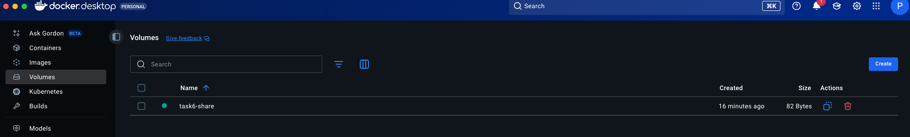
Writer:
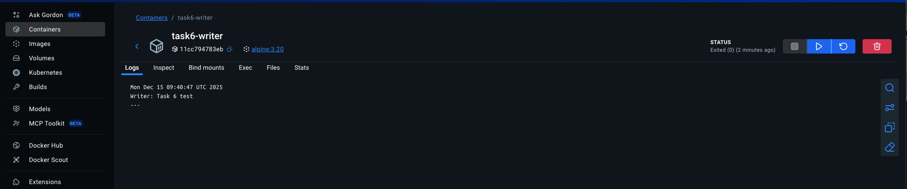
mounted volume:
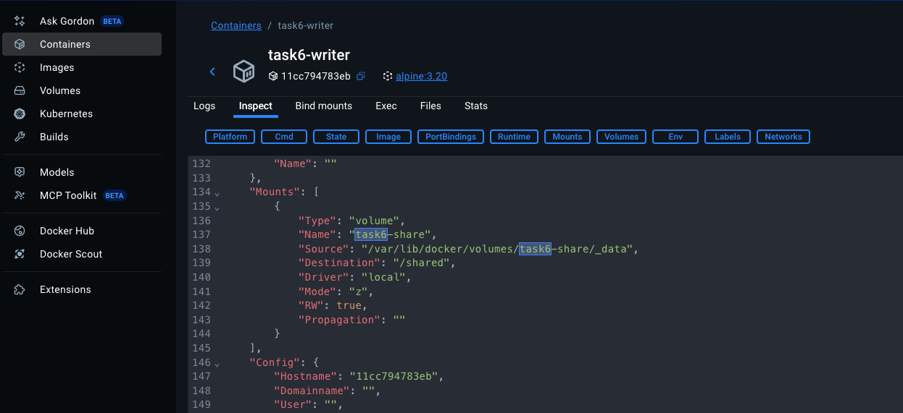
Reader:
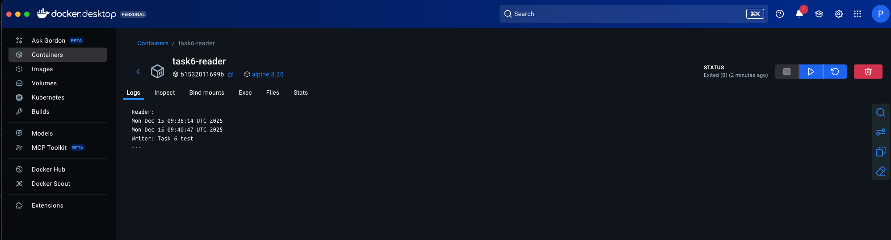
mounted volume :
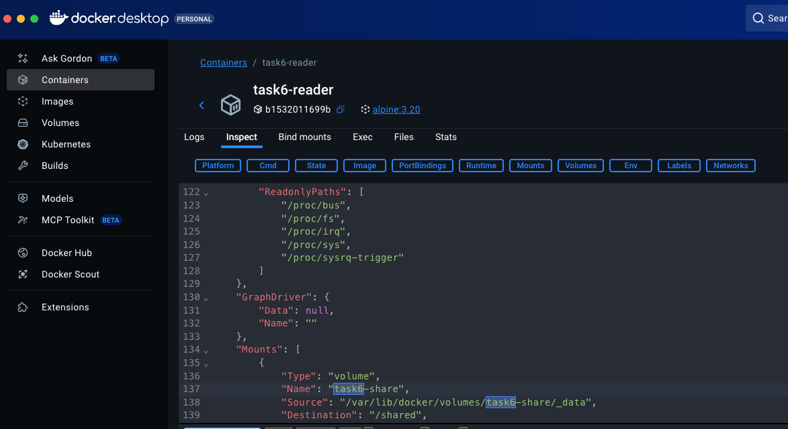
Containers:
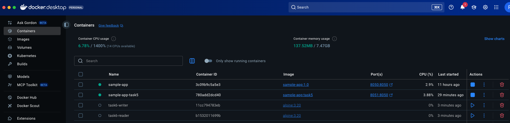
inspect:
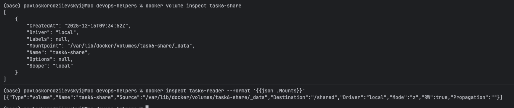

Task 7 
screenshot:
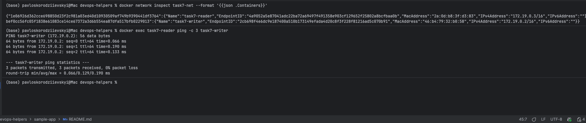
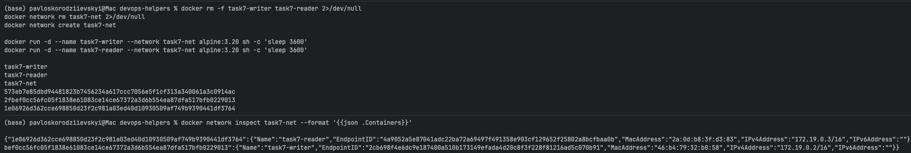